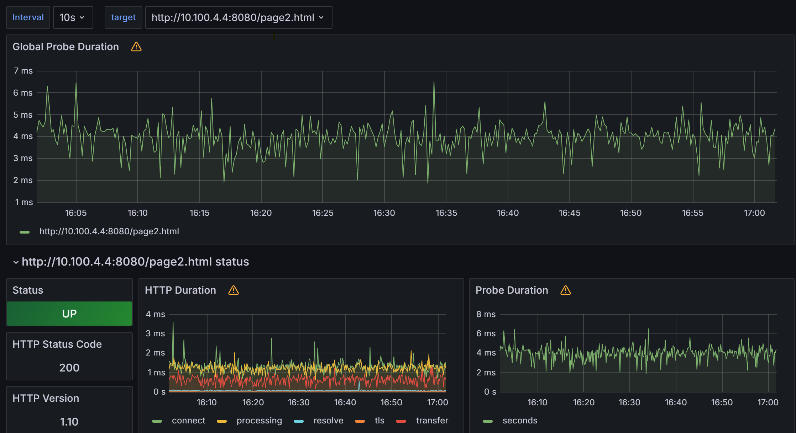

# Projet Prométhéus/grafana/exportateurs

Dans le cadre de notre projet, il nous a été demandé de  déployer un outil de surveillance réseau. Cet outil devait être capable d'analyser plusieurs types de machines ainsi que plusieurs types de protocoles. Prométhéus, l'outil donc, sera le coeur de notre surveillance réseau en jouant plusieurs rôles. Il sera chargé, selon sa configuration, de faire des requêtes à ses différents exportateurs. À leurs tours, les exportateurs iront faire des requêtes aux différents noeuds(machine, routeur, switch etc..) et renverront les résultats à prométhéus. Prométhéus aura également un rôle de stockeur de données dans sa base PROMQL. Les possibilités visuelles de prométhéus restant assez maigres, il nous a été demandé d'utiliser grafana afin d'observer les données.

## Sommaire


- [Architecture de notre Dossier](#architecture-de-notre-dossier)
  - [Lien clickables](#lien-clickables)
- [Conteneurisation](#conteneurisation)
- [Comment Prométhéus commande t-il les différents exportateurs?](#comment-prométhéus-commande-t-il-les-différents-exportateurs)
  - [Rôle du fichier prométhéus.yml](#rôle-du-fichier-prométhéusyml)
- [Les différents exportateurs en place](#les-différents-exportateurs-en-place)
  - [SNMP-EXPORTER](#snmp-exporter)
    - [Pourquoi?](#pourquoi)
    - [Pour qui?](#pour-qui)
    - [Les prérequis](#les-prérequis)
    - [Configuration](#configuration)
    - [SNMP GENERATOR](#SNMP-GENERATOR)
  - [BlackBox](#blackbox)
    - [Pourquoi?](#pourquoi-1)
    - [Pour qui?](#pour-qui-1)
    - [Les prérequis](#les-prérequis-1)
    - [Configuration](#configuration-1)
  - [Node Exporter](#node-exporter)
    - [Pourquoi?](#pourquoi-2)
    - [Pour qui?](#pour-qui-2)
    - [Les prérequis](#les-prérequis-2)
    - [Configuration](#configuration-2)
  - [cAdvisor](#cadvisor)
    - [Pourquoi?](#pourquoi-3)
    - [Pour qui?](#pour-qui-3)
    - [Les prérequis](#les-prérequis-3)
    - [Configuration](#configuration-3)
- [PromQL](#promql)
- [Grafana](#grafana)
  - [Blackbox](#blackbox-1)
  - [cAdvisor](#cadvisor-1)
  - [Node exporter](#node-exporter-1)
  - [SNMP exporter](#snmp-exporter-1)

## Architecture de notre Dossier
``` PS
PS C:\Users\Arizzi Alexandre\Documents\Apprentissage\TRI\Master 1\Projet Monitoring\git\23-813-LEICHTNAM-ARIZZI\monitoring> tree /F
Structure du dossier
C:.
│   docker-compose.yml
├───grafana
│       datasource.yml
│       grafana.conf
└───prometheus
    │   prometheus.yml
    │   
    │
    ├───blackbox
    │       blackbox.yml
    │
    └───snmp-exporter
            snmp.yml
```
### Lien clickables 
* [docker-compose.yml](https://github.com/alexvallau/23-813-LEICHTNAM-ARIZZI/blob/main/monitoring/docker-compose.yml)  
* [datasource.yml](https://github.com/alexvallau/23-813-LEICHTNAM-ARIZZI/blob/main/monitoring/grafana/datasource.yml)
* [prometheus.yml](https://github.com/alexvallau/23-813-LEICHTNAM-ARIZZI/blob/main/monitoring/prometheus/prometheus.yml)
* [blackbox](https://github.com/alexvallau/23-813-LEICHTNAM-ARIZZI/blob/main/monitoring/prometheus/blackbox/blackbox.yml)
* [snmp.yml](https://github.com/alexvallau/23-813-LEICHTNAM-ARIZZI/blob/main/monitoring/prometheus/snmp-exporter/snmp.yml)
* [generator.yml](https://github.com/alexvallau/23-813-LEICHTNAM-ARIZZI/blob/main/monitoring/generator.yml)

## Conteneurisation

Le lecteur est grand expert docker, nous ne détaillerons donc pas notre docker-compose. Nous glissons juste que toutes les applications de notre projet ont été conteneurisées. Voici les applications déployées.

Sur l'hôte de proméhétus(192.168.170.81):

| Nom de conteneurs | Mappage des ports | Utilité                             |
|-------------------|-------------------|-------------------------------------|
| prometheus        | 9090:9090         | Système de surveillance             |
| grafana           | 3000:3000         | Tableau de bord pour les données   |
| snmp-exporter     | 9116:9116, 161:161/udp | Exportateur SNMP                |
| blackbox_exporter| 9115:9115         | Surveille des pages WEB                |


Sur une machine linux monitorée(10.100.4.4):
| Nom de conteneurs | Mappage des ports | Utilité                             |
|-------------------|-------------------|-------------------------------------|
| node-exporter     | 9100:9100         | Exportateur de métriques système   |
| cAdvisor     | 8081:8081         | Exportateur de métriques système   |

## Comment Prométhéus commande t-il les différents exportateurs?

C'est vrai ça! Comment le faire? Nous avons déployé pleins de conteneurs, mais comment intérragissent-ils entre eux? Que faut-il configurer afin que  prométhéus envoient ses directives(j'entends par là, comment prométhéus communique avec ses exportateurs)? Comment configurer la fréquence? Comment ajouter de nouveaux jobs? C'est ce que nous voyons tout de suite.

### Rôle du fichier prométhéus.yml

Lorsque nous conteneurisons Prométhéus dans [docker-compose.yml](https://github.com/alexvallau/23-813-LEICHTNAM-ARIZZI/blob/main/monitoring/docker-compose.yml)  ,nous attachons à son image un fichier de configuration: [prometheus.yml](https://github.com/alexvallau/23-813-LEICHTNAM-ARIZZI/blob/main/monitoring/prometheus/prometheus.yml).
C'est dans ce fichier que l'on indique à prométhéus comment communiquer avec ses exportateurs et avec qui ses exportateurs doivent échanger.Dans ce fichier, nous configurons une "scrape_configs:", dans laquelle nous renseignons les différents travaux, "job" de prométhéus.
Si nous prenons l'exemple de SNMP exporter:
``` yml
  - job_name: 'snmp-exporter-cisco'  # Configuration pour récupérer les métriques SNMP des appareils Cisco.
    static_configs:
      - targets: #Ici on renseigne
        - 10.100.4.1 #Ip du routeur 1
        - 10.100.4.2 #  Ip du routeur 2
    scrape_interval: 1s  # Fréquence de rafraîchissement.
    scrape_timeout: 1s  # Délai d'attente.
    metrics_path: /snmp
```
Concrètement, on demande ici à prométhéus d'aller faire des requêtes toutes les 1 secondes à notre SNMP-exporter(lui aussi conteneurisé), qui ira lui même faire des requêtes aux cibles qui ont été indiquées dans notre fichier. 
Tous les travaux,jobs de prométhéus fonctionnent de la même manière. Si l'on veut ajouter des novueaux jobs à notre environnement de moniroting, il faut  suivre, à quelque chose près, machinalement ces étapes:
1. Dans le fichier docker-compose:
   * J'ajoute Prométhéus avec son fichier de configuration prométhéus.yml
   * J'ajoute mes différents exportateurs avec leurs fichiers de configuration(ex: snmp.yml)
2. Dans prométhéus.yml:
   * Je créé mes différents jobs vers mes exportateurs
      * J'ajoute mes différentes cibles
      * J'ajuste la fréquence de mes requêtes


## Les différents exportateurs en place

### SNMP-EXPORTER
snmp-exporter est un module développé par les contributeurs de prométhéus.

#### Pourquoi?
Comme son nom l'indique, il sera chargé de faire des requêtes SNMP sur différents noeuds. Il renverra ensuite le résultat des noeuds, dans un format adapté, à prométhéus.
#### Pour qui?
Dans notre projet, il nous a été utile pour les deux routeurs cisco(10.100.4.1 et 10.100.4.2).
#### Les prérequis
* Routeurs: Avoir configuré SNMPV2 avec une communauté
* Machine hôte: Avoir docker d'installé \
Il faudra biensûr une connectivité réseau entre les différents éléments..
#### Configuration
##### SNMP-GENERATOR
Si nous regardons dans notre [docker-compose.yml](https://github.com/alexvallau/23-813-LEICHTNAM-ARIZZI/blob/main/monitoring/docker-compose.yml), nous observons au niveau du volume de snmp-exporter cette ligne:

``` yml
 - '/home/etudiant/monitoring/prometheus/snmp-exporter/snmp.yml:/etc/snmp_exporter/snmp.yml'
 ```
 Elle parraît presque annodine. En soit elle ne déclare qu'un fichier de configuration....

 #### [snmp.yml](https://github.com/alexvallau/23-813-LEICHTNAM-ARIZZI/blob/main/monitoring/prometheus/snmp-exporter/snmp.yml)
  
Ce fichier est la clé de voûte de SNMP-exporter. Si on l'ouvre, on y verra énormément d'informations: des oid, des versions SNMP. Par exemple:
``` YML
# WARNING: This file was auto-generated using snmp_exporter generator, manual changes will be lost.
auths:
  public_v2:
    community: 123test123 #On y retrouve la communauté configurée sur nos switchs
    security_level: noAuthNoPriv
    auth_protocol: MD5
    priv_protocol: DES
    version: 2
modules:
  if_mib:
    walk:
    - 1.3.6.1.2.1.31.1.1.1.10 # On y retrouve les différents OID qui nous seront utiles plus tard, iHCoutOctets etc..
    - 1.3.6.1.2.1.31.1.1.1.6
    - 1.3.6.1.2.1.68.1.3.1.3
    get:
    - 1.3.6.1.2.1.1.3.0
    metrics:
    - name: sysUpTime
      oid: 1.3.6.1.2.1.1.3
```
Ce fichier n'est ni le fruit d'un copié-collé et n'a ni été volé sur internet.
Les concepteurs de SNMP exporteurs ont développé un "snmp-generator" qui va nous générer le fichier ci-dessus.
Le principe  du générateur est simple. On indique les informations qui nous intéressent dans la base mib. Nous ne sommes même pas obligés d'indiquer les OID. Le generateur est assez bien développé pour retrouver lui même les oid des éléments qui nous intéressent.
Ainsi, si je cherche par exemple l'état de mes interfaces vrrp, je n'aurai qu'à indiquer "vrrpOperState":

``` yml
  if_mib:
    walk: [....vrrpOperState...]
.........
``` 

Que notre générateur traduira par:

```yml
    - name: vrrpOperState
      oid: 1.3.6.1.2.1.68.1.3.1.3
      type: gauge
      help: The current state of the virtual router - 1.3.6.1.2.1.68.1.3.1.3
      indexes:
      - labelname: ifIndex
        type: gauge
      - labelname: vrrpOperVrId
        type: gauge
.........
```

Les étapes à suivre sont donc:
1. Je clone le repo officiel de SNMP-exporter
2. Je vais dans le dossier /snmp_exporter/generator
3. Je modifie selon mes besoins le fichier generator.yml
4. J'éxécute la commande suivante:
```bash
make docker-generate
```
5. Le fichier snmp.yml vient d'être généré,  je peux m'en servir pour mon conteneur snmp-exporteur.


### BlackBox
Blakckbox est un autre exporteur. Il nous servira à checker le status de différentes pages web en émettant des requêtes http

#### Pourquoi?
On peut vérifier si les pages web de nos serveurs sont accessibles.
#### Pour qui?
Dans notre projet, il nous a été demandé de déployer un site conteneurisé avec 3 pages web différentes.
#### Les prérequis
* Serveur: Avoir déployé le site web conteneurisé
* Machine hôte: Avoir docker d'installé \
Il faudra biensûr une connectivité réseau entre les différents éléments..
#### Configuration
Contrairement à SNMP-exporter, il y a très peu de choses à configurer. Nous devons simplement monter le conteneur et déclarer le job blackbox. Ce module est extrèmement bien documenté et la mise en place se fait naturellement, en suivant simplement le tutoriel de blackbox sur git.
Une partie importante lors de la déclaration du job dans prométhéus.yml:
``` yml
  - job_name: 'blackbox'
    metrics_path: /probe
    params:
      module: [http_2xx]  # Look for a HTTP 200 response.
    static_configs:
      - targets:
        - http://10.100.4.4:8080 # Target to probe with http on port 8080.
        - http://10.100.4.4:8080/page1.html
        - http://10.100.4.4:8080/page2.html
```
On voit comment ajouter les pages que l'on souhaite monitorer.

### node exporter
Node exporter va nous servir à récupérer des informations sur des machines hôtes.

#### Pourquoi?
On peut vérifier par exemple l'utilisation du CPU, de la RAM, la disponibilité de stockage..
#### Pour qui?
Dans notre projet, il nous a été demandé de déployer une machine linux à monitorer
#### Les prérequis
* Machine à monitorer: Déployer docker-compsoe avec node-exporter 
* Machine qui monitorera la machine linux: Configurer un job prométhéus qui ira requêter la machine à monitorer
#### Configuration

##### Depuis notre serveur prométhéus
Nous avons simplement configuré le job suivant dans [prometheus.yml](https://github.com/alexvallau/23-813-LEICHTNAM-ARIZZI/blob/main/monitoring/prometheus/prometheus.yml) 
``` yml
  - job_name: 'node'
    static_configs:
      - targets: ['10.100.4.4:9100'] #machine linux à monitorer
``` 
##### Depuis la machine linux à monitorer

a finir


### cAdvisor
cAdvisor va être utile à monitorer des conteneurs docker.

#### Pourquoi?
Afin de voir les ressources utilisés par le conteneur. Comme le CPU, la bande passante, la mémoire disponible etc..
#### Pour qui?
Dans notre projet, il nous a été demandé de monitorer les conteneurs de notre machine 
#### Les prérequis
* Machine à monitorer: avoir des conteneurs déployés. Installer cAdvisor
* Machine qui monitorera la machine linux: Configurer un job prométhéus qui ira requêter la machine à monitorer
#### Configuration

##### Depuis notre serveur prométhéus
Nous avons simplement configuré le job suivant dans [prometheus.yml](https://github.com/alexvallau/23-813-LEICHTNAM-ARIZZI/blob/main/monitoring/prometheus/prometheus.yml) 
``` yml
  - job_name: cadvisor
    scrape_interval: 5s
    static_configs:
    - targets:
        - 10.100.4.4:8081 #Cible
``` 
## PromQL
PromQL est le langage de requête de Prometheus, qui permet de récupérer et de manipuler les métriques de surveillance pour analyser les performances des systèmes informatiques de manière avancée et précise. Il offre des fonctionnalités telles que le filtrage, l'agrégation et le calcul de tendances, facilitant ainsi la surveillance efficace des environnements informatiques.

Exemple de requete promql : 

ifHighSpeed{job="snmp-exporter-cisco"} 


Ce graphique montre la vitesse configurée pour différentes interfaces réseau. La métrique ifHighSpeed indique la vitesse théorique maximale de chaque interface, ce qui est crucial pour évaluer la capacité du réseau.

rate(ifOutOctets{job="snmp-exporter-cisco", instance="10.100.4.1"}[5m])


Le deuxième graphique représente le trafic sortant d'une interface spécifique, mesuré par la fonction rate(ifOutOctets[5m]) en octets par seconde. Cela aide à identifier les tendances du trafic et les pics potentiels qui pourraient affecter les performances réseau.


## Grafana
Nous ne détaillerons pas grand chose ici mise à part la déclaration des alertes.

### Alertes
Nous avons créé des alertes à un seuil de 50 bits.
Nous pouvons voir sur l'image ci-dessous, au niveau des pointillets verticaux les moments ou elles sont déclenchées.


Une fois que ces alertes sont déclenchées, nous nous servons d'un serveur google smtp afin d'envoyer des mail d'alerte:

L'image est assez peu explicite mais il faut comprendre que C représente le nombre de bit atteint. Ici il est de 205 bit/s, d'ou l'alerte.
### Blackbox


### cAdvisor


### Node exporter


### SNMP exporter


## Conclusion générale et difficultés

Pour commencer de manière  ordinaire, ce projet a été extrêmement intéréssant car nous avons pu travailler sur beaucoup de systèmes différents. Cela nous a permis par exemple de nous remettre dans le bain pour les commandes cisco, de recomprendre le mécanisme docker avec ses volumes, ses images, et de découvrir des protocoles tels que VRRP. Par dessus tout ça, nous avons travaillé avec prométhéus, quelque chose de nouveau pour M. Arizzi et M. LEICHTNAM et qui sera certainement utile un jour ou l'autre en entreprise. Nous avon beaucoup aimé l'autonomie qui nous as été accordée au cours de ce projet, nous prouvant que, moyennant un travail certain, nous avons été capables de compléter quasiment tout le projet demandé, sans l'aide d'autres groupes, self-made.
Le plus dur pour nous dans ce projet a été de trouver les outils et de comment les exploiter. Mettez-vous à notre place, nous avons dû découvrir prométhéus entièrement, découvrir ses relations avec ses exportateurs, trouver le "SNMP-GENERATOR" et le faire fonctionner etc....
A celà, et même si vous êtes sur la bonne voie, s'ajoute les bugs, la mauvaise indentation, qui vous font parfois douter: "est-ce que c'est bien ça que je dois faire"- .
En terme de temps de travail, nous avons dû ajouter au moins 20 h supplémentaires aux séances.
Nous comptons ici la finalisation du projet + la rédaction des différents documents.
Mais pour rester sur une note positive; nous avons beaucoup appris. + de projets svp


